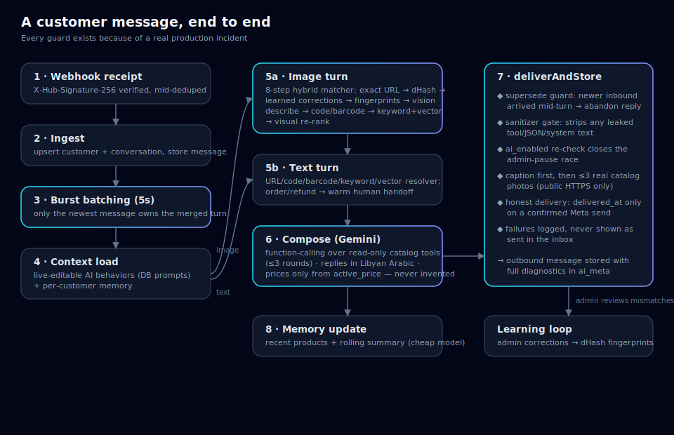

# English Home Libya — AI Customer-Service Platform

A production AI agent that runs customer service for a real retail franchise's
Facebook page (~250k reach), answering in **Libyan Arabic**, recognizing
products from **customer photos**, and quoting prices only from the live
catalog — wrapped in a bilingual (AR/EN, RTL-first) admin command center.

Built for and operated by the English Home Libya franchise. The whole system
runs on **one ~€5/month VPS** with exactly two external dependencies: the
Gemini API and Meta's Graph API.


## What it does

- **Answers Messenger DMs and story replies automatically** using the exact
  language and service behavior configured in AI Control,
  grounded in the real catalog — the model can call read-only product tools
  (code/barcode/URL/keyword/semantic lookup) but can never invent a price.
- **Recognizes products from photos** with an 8-step hybrid matcher:
  exact-URL → perceptual dHash → learned admin corrections → fingerprint
  near-duplicates → Gemini vision description → visible code/barcode →
  keyword + embedding retrieval → visual re-rank. Admin corrections feed
  fingerprints back, so the same mistake gets less likely over time.
- **Sends real catalog photos** when a customer asks to see a product
  (max 3, de-duplicated, public HTTPS only, honest delivery accounting).
- **Hands off gracefully**: order/refund/complaint intents get a warm
  human-handoff reply and pause the AI for that conversation.
- **Admin command center**: inbox with AI pause/resume and suggested drafts,
  4,700-product catalog with image-match review queues, campaign builder with
  AI captions and image editing, a sectioned AI Control prompt workbench, and a
  playground that runs the production compiler and execution paths.

## Production hardening (the interesting bits)



Every guard in the pipeline exists because of a real incident:

| Guard | Incident it prevents |
|---|---|
| **Burst batching** (5s window, newest-message-wins) | three rapid messages → three disjoint AI replies |
| **Supersede guard** in `deliverAndStore` | image + "how much?" arriving together → double reply to one burst |
| **`ai_enabled` re-check at send time** | AI reply landing seconds after an admin took over |
| **Output sanitizer gate** | the model echoing `catalog_search(...)` or system text into customer chat |
| **Honest delivery** (`delivered_at` only on confirmed send) | inbox showing failed sends as delivered |
| **Model router + fallback chain** | image generation dying when the strong model is rate-limited |

## Architecture

```
├── admin-app/        Next.js 16 App Router — UI + API routes (jose session auth)
├── integrations/     Framework-agnostic core, shared by app + scripts
│   ├── db/           Kysely + pg (typed queries; codegen'd schema types)
│   ├── gemini/       central model router — per-task models, fallback chains
│   ├── prompt-compiler.ts typed AI Control compiler + prompt trace
│   ├── meta/         Graph API client + webhook signature verification
│   ├── pipelines/    messenger turn engine, hybrid image matcher, campaigns
│   ├── tools/        the AI's ONLY database access (read-only, price-safe)
│   └── storage/      media on disk, served by Caddy at media.<domain>
├── database/         plain-SQL schema + 14 ordered migrations
├── scripts/          local catalog import/enrich CLIs (scraper → Postgres)
├── deploy/           Caddyfile, backup cron, VPS runbook
└── docs/             architecture, operations, AI pipeline deep-dives
```

Companion repositories:

- [english-home-catalog-scraper](https://github.com/lla7wel/english-home-catalog-scraper)
  — resumable Playwright-over-CDP scraper (real-Chrome Cloudflare bypass) that
  builds the product/image database this platform imports.
- [trilingual-catalog-matcher](https://github.com/lla7wel/trilingual-catalog-matcher)
  — the Arabic/Turkish/English product-matching engine, extracted from
  `integrations/catalog-match.ts` as a zero-dependency library.
- [visual-product-matcher](https://github.com/lla7wel/visual-product-matcher)
  — the photo-recognition pipeline (dHash backbone, learning loop, pluggable
  vision/retrieval) as a standalone, provider-agnostic library.

## Engineering decisions

- **Self-hosted over serverless** — the platform previously ran on
  Supabase + Vercel + Cloudflare; a free-tier pause took production down.
  Everything now runs in one `docker compose up`: Postgres 16, the Next.js
  standalone server, and Caddy (auto-HTTPS). Backups are a nightly `pg_dump`
  with offsite copy — the database is the only non-rebuildable state.
- **Kysely over an ORM** — the schema lives in plain SQL migrations;
  `kysely-codegen` derives types from the live database, so queries are fully
  typed without a second schema definition. pg type parsers keep row shapes
  identical to what the app was written against (ISO-string timestamps,
  numeric → number).
- **Embeddings in JSONB, cosine in code** — at 4,700 products a bounded scan
  is milliseconds; pgvector + HNSW is an upgrade path, not a day-one need.
- **One reply composer** — the live webhook, the inbox "suggest" button and
  the playground all call the same `composeCustomerReply()`, so what the admin
  tests is exactly what customers get.
- **AI Control is authoritative** — typed tasks compile immutable execution
  policy, exact editable sections, structured runtime facts, tools/schema and a
  trace hash. Provider adapters contain no hidden English Home behavior prose.
- **Arabic-first UI** — the admin is RTL-first with AR/EN dictionaries;
  customer and marketing language is configured in AI Control.

## Run it locally

```bash
createdb eh_system
psql -d eh_system -f database/bootstrap.sql
psql -d eh_system -f database/schema.sql
for f in database/migrations/0*.sql; do psql -d eh_system -v ON_ERROR_STOP=1 -f "$f"; done

cp .env.example .env        # set DATABASE_URL + ADMIN_* + SESSION_SECRET
cd admin-app && npm install && npm run dev
```

The app runs with integrations unconfigured — each shows a clear
"not connected" card instead of faking data.

**Production** is one command on a VPS: `docker compose up -d --build` —
see [deploy/setup-vps.md](deploy/setup-vps.md) for the zero-to-production
runbook (domain, TLS, Meta webhook, backups, smoke tests).

## Tests

```bash
cd scripts
npx tsx upgrade-tests.ts             # focused pure-logic regression suite (sanitizer, policy, hashing)
npx tsx ai-control-behavior-test.ts  # compiler, provenance, parity and prompt boundaries
```

## Documentation

| Doc | Covers |
|---|---|
| [docs/ARCHITECTURE.md](docs/ARCHITECTURE.md) | system design, folder ownership, invariants |
| [docs/AI_AND_MESSENGER.md](docs/AI_AND_MESSENGER.md) | the conversation pipeline + image matcher, step by step |
| [docs/CATALOG_AND_PRODUCTS.md](docs/CATALOG_AND_PRODUCTS.md) | price truth, import flow, matching, admin locks |
| [docs/CAMPAIGNS.md](docs/CAMPAIGNS.md) | campaign builder, AI creative generation, scheduler |
| [docs/DATABASE.md](docs/DATABASE.md) | data model + migration history |
| [docs/OPERATIONS.md](docs/OPERATIONS.md) | day-to-day admin workflow |
| [deploy/setup-vps.md](deploy/setup-vps.md) | production deployment runbook |

## Security posture

- The middleware session gate (jose HS256, httpOnly cookie) is the security
  boundary — every page and API route except the webhook, health check, cron
  tick and auth endpoints requires it.
- Meta webhook posts are verified with `X-Hub-Signature-256` (timing-safe).
- The cron endpoint requires a bearer secret; it returns 503 rather than
  running unprotected if the secret is unset.
- No secrets in the repository — configuration is env-only, documented in
  [.env.example](.env.example).
