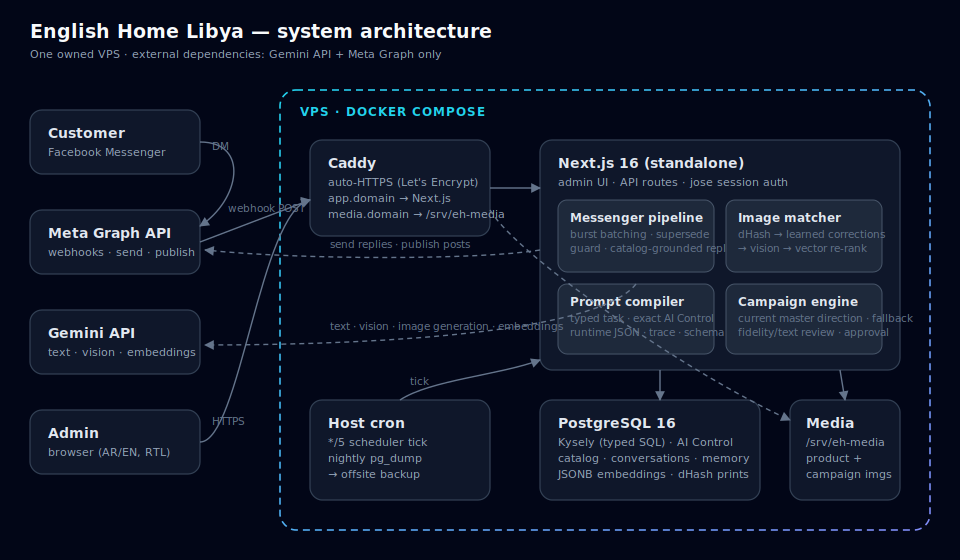

# Architecture

## 1. System overview



```
                      ┌──────────────────────────────────┐
   Admin browser ────▶│  Next.js admin-app (App Router)  │
   (AR/EN, RTL)       │  • dashboard UI pages            │
                      │  • API routes (webhooks, AI)     │
                      └──────────────┬───────────────────┘
                                     │ server-only
               ┌─────────────────────┼──────────────────────┐
               ▼                     ▼                      ▼
       ┌──────────────┐     ┌──────────────┐     ┌──────────────────┐
       │  PostgreSQL  │     │   Gemini     │     │   Meta Graph API │
       │  (Kysely) +  │     │  chat, tools,│     │  Messenger DMs + │
       │  media on    │     │  vision,     │     │  story replies + │
       │  disk (Caddy)│     │  embeddings, │     │  page posts      │
       └──────────────┘     │  image gen   │     └──────────────────┘
               ▲            └──────────────┘
               │ read-only import (scripts only, never deployed)
       ┌───────┴──────────────────────────┐
       │  ../english-home-tr-scraper      │  ← SEPARATE project. Never touched.
       │  data/output/*.json, data/images │
       └──────────────────────────────────┘
```

## 2. Folder ownership

| Path | Owns |
|------|------|
| `admin-app/` | Next.js app: UI pages, API route handlers, middleware. Nothing here calls vendor SDKs directly. |
| `integrations/` | Framework-agnostic runtime layer: database (Kysely), Gemini, Meta, media storage, Messenger pipeline, image matching, campaign pipeline, product tools, AI behaviors. Imported by the app and the local scripts. |
| `database/` | Postgres schema, ordered migrations (0001–0013), bootstrap + cutover helpers. |
| `scripts/` | **Local-only** catalog import tools (`catalog:csv`, `import:products`, `upload:images`, `embeddings`). Never imported by the deployed app. |
| `deploy/` | Docker/Caddy/cron/backup configuration + the VPS runbook. |
| `docs/` | All documentation. |

## 3. Runtime flow

**Inbound Messenger message:**
```
POST /api/meta/webhook
  → verifyWebhookSignature() (HMAC-SHA256)
  → processMessengerEvents()
  → ingestInbound() (upsert customer + conversation, dedupe by external_id)
  → [batching] runMessageBatchDebounce() — waits for burst to settle
  → runConversationTurn()
      → getCustomerMemory()
      → decideAgentAction() → image_turn | text_turn
      → handleImageTurn() / handleTextTurn()
      → composeCustomerReply() (Gemini, temp 0.7, with product tools)
      → deliverAndStore() — supersede check → Meta send → store message
      → updateMemoryAfterTurn()
```

**Admin page load:** Next.js server component queries Postgres through Kysely. The middleware session gate (jose HS256 cookie) enforces that the admin is authenticated before any server component or API handler runs.

**Admin action (e.g. manual reply):** Client component → `fetch /api/inbox/[id]` → Kysely write → Meta send (for outbound messages).

## 4. What is production runtime

These run on every request / Messenger event:
- `admin-app/` (Docker on the VPS, behind Caddy)
- `integrations/pipelines/` — Messenger, image-match, compose-reply, product-resolve, context-followup, agent-policy
- `integrations/gemini/`, `integrations/meta/`, `integrations/tools/`
- `integrations/ai-behaviors.ts`, `integrations/flags.ts`, `integrations/product-locks.ts`

## 5. What is local/offline only

Never deployed; run manually on a developer's machine:
- `scripts/` — all catalog import tools
- `../english-home-tr-scraper/` — separate project, this repo never touches it

## 6. Critical files — do not edit without a full plan

| File | Why |
|------|-----|
| `integrations/pipelines/messenger.ts` | Entire Messenger agent loop; every inbound customer message flows through it |
| `integrations/pipelines/image-match.ts` | Canonical image→product matcher; both live pipeline and Playground call it |
| `integrations/pipelines/compose-reply.ts` | Single canonical customer-reply path via `composeCustomerReply` |
| `integrations/pipelines/product-resolve.ts` | Text/URL→catalog resolver used in every product-question reply |
| `integrations/pipelines/agent-policy.ts` | Decides image turn vs. text turn — pure logic, high impact |
| `integrations/tools/` | Controlled DB tools — the AI's only catalog access |
| `integrations/gemini/index.ts` | All AI functions including `chatReplyWithTools`, `embedText` |
| `integrations/gemini/client.ts` | Low-level Gemini HTTP client |
| `integrations/meta/index.ts` | All Meta Graph API calls; a bug here can corrupt sends or fail webhook verification |
| `integrations/ai-behaviors.ts` | Behavior loader + prompt composer used by all pipelines |
| `integrations/product-locks.ts` | Admin-lock enforcement; a bug silently lets imports overwrite admin decisions |
| `admin-app/src/middleware.ts` | Auth gate — the security boundary for all admin routes |
| `admin-app/src/app/api/meta/webhook/route.ts` | Canonical webhook entry; changing signature verification drops messages |
| `database/migrations/*.sql` | Applied migrations — do not modify a migration that has already been run |

## 7. High-risk files — edit carefully, test end-to-end before deploying

| File | Risk |
|------|------|
| `admin-app/src/app/api/products/[productId]/price/route.ts` | Activates products into the live catalog; wrong logic makes unready products customer-visible |
| `admin-app/src/app/api/campaigns/[campaignId]/route.ts` | Campaign publish; calls Meta Graph API |
| `admin-app/src/app/api/cron/campaign-scheduler/route.ts` | Pricing refresh + auto-publish; has auth check — do not remove it |
| `integrations/db/client.ts` | The database handle — never import into a client component |
| `integrations/util/customer-text.ts` | Outbound safety sanitizer; weakening it leaks system text to customers |

## 8. Security invariants

These must not be changed:
- `DATABASE_URL` and `SESSION_SECRET` must never have a `NEXT_PUBLIC_` prefix and must never reach the browser.
- `admin-app/src/middleware.ts` gates all `/dashboard/*` and `/api/*` routes (except `/api/meta/webhook`, `/api/health`, `/api/cron/campaign-scheduler`, `/login`). This is the only security boundary — RLS is not relied on for admin-app security.
- The Meta webhook verifies `X-Hub-Signature-256` on every POST. Do not weaken this.
- The cron route verifies `CRON_SECRET`. Do not remove this check.

## 9. The "not connected" contract

`integrationStatus()` reads env and returns `{ configured: boolean, missing: string[] }` per integration. Server endpoints return `503 integration_not_configured` when something is missing. No code path substitutes fake data for a missing integration.

## 10. Removed features (do not reintroduce)

| Removed | Migration / Pass |
|---------|-----------------|
| Orders module (`/orders`, order-draft inbox actions, `orders`/`order_items` tables) | 0012 |
| Catalog Sync (`/api/catalog-sync`, `lib/sync/runner.ts`, Sync tab in catalog review) | 0012 / cleanup pass |
| Facebook comments workflow + `comment_reply_rules` | 0010 / 0012 |
| Hard-coded Arabic reply templates | AI quality pass |
| Random product fallback in image matching | AI quality pass |
| `escalations`, `product_variants`, `ai_settings` tables | 0012 |
| Legacy `extractOrderDraft` from Gemini | cleanup pass |
